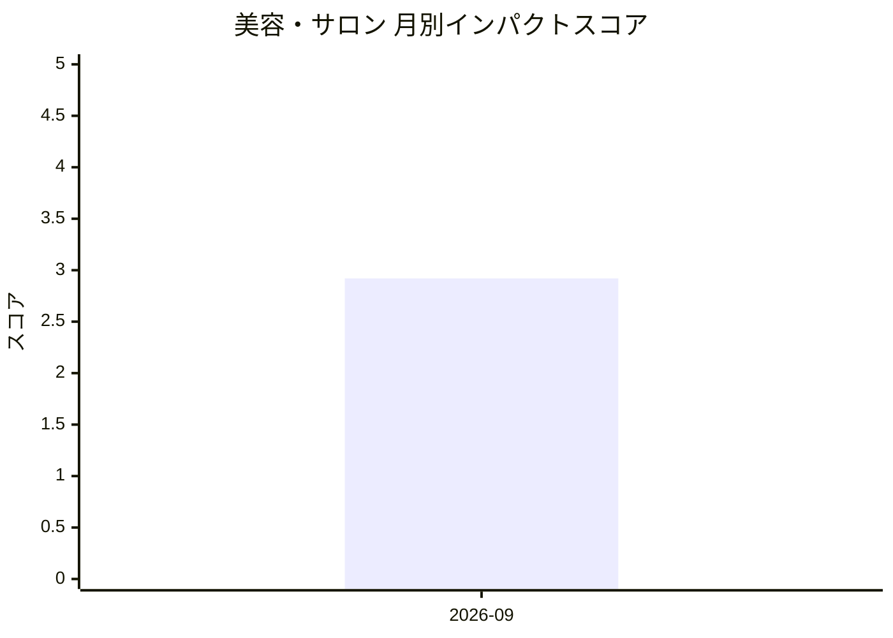

# 美容・サロン — AI活用インパクトスコア

> 最終更新: 2026-09-12 23:38 UTC | 関連記事数: 2件

## 月別インパクトスコア推移

| 月 | 関連記事数 | 平均スコア |
|-----|-----------|-----------|
| 2026-09 | 2件 | 2.92 |

## 注目記事 TOP3

### 1. [Meta、パーソナルAIエージェント「Muse」発表　メール送信や買い物も代行（まずは米国で無料提供開始）](https://www.itmedia.co.jp/news/article/2609/09/2000001294/)
**3.0 ★★★☆☆** | ITmedia AI | 2026-09-08

（スコアリングAPIエラー）

### 2. [What will Apple’s John Ternus era look like?](https://techcrunch.com/video/what-will-apples-john-ternus-era-look-like/)
**2.9 ★★☆☆☆** | TechCrunch AI | 2026-09-04

（スコアリングAPIエラー）

---
*本ページは ai-research システムにより自動生成されました。*