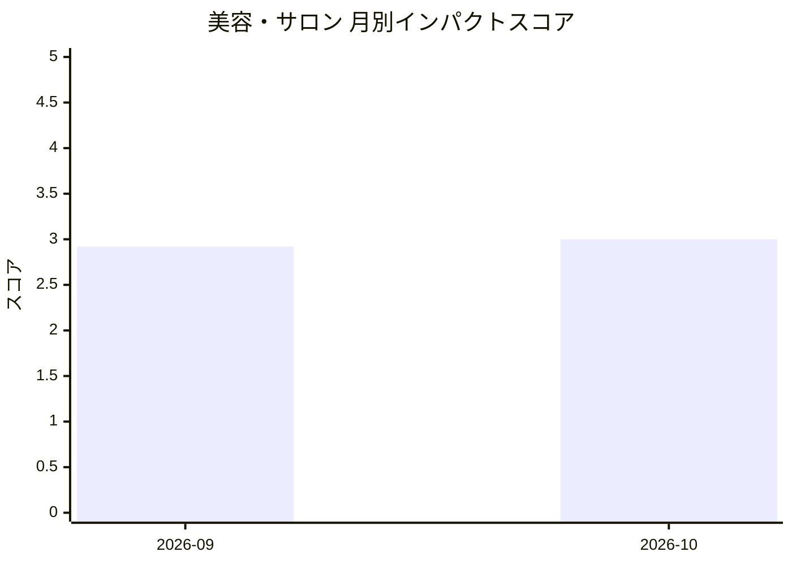

# 美容・サロン — AI活用インパクトスコア

> 最終更新: 2026-10-11 00:36 UTC | 関連記事数: 3件

## 月別インパクトスコア推移

```mermaid
xychart-beta
  title "美容・サロン 月別インパクトスコア"
  x-axis [2026-09, 2026-10]
  y-axis "スコア" 0 --> 5
  bar [2.92, 3.0]
```

| 月 | 関連記事数 | 平均スコア |
|-----|-----------|-----------|
| 2026-10 | 1件 | 3.00 |
| 2026-09 | 2件 | 2.92 |

## 注目記事 TOP3

### 1. [Meta、パーソナルAIエージェント「Muse」発表　メール送信や買い物も代行（まずは米国で無料提供開始）](https://www.itmedia.co.jp/news/article/2609/09/2000001294/)
**3.0 ★★★☆☆** | ITmedia AI | 2026-09-08

（スコアリングAPIエラー）

### 2. [「予約機能を作って」は失敗する。Claude Codeへの指示は「やらないこと」と判断基準を渡す(Larave](https://zenn.dev/mugen_web/articles/claude-code-instruction-granularity)
**3.0 ★★★☆☆** | Zenn AI トピック | 2026-10-08

（スコアリングAPIエラー）

### 3. [What will Apple’s John Ternus era look like?](https://techcrunch.com/video/what-will-apples-john-ternus-era-look-like/)
**2.9 ★★☆☆☆** | TechCrunch AI | 2026-09-04

（スコアリングAPIエラー）

---
*本ページは ai-research システムにより自動生成されました。*