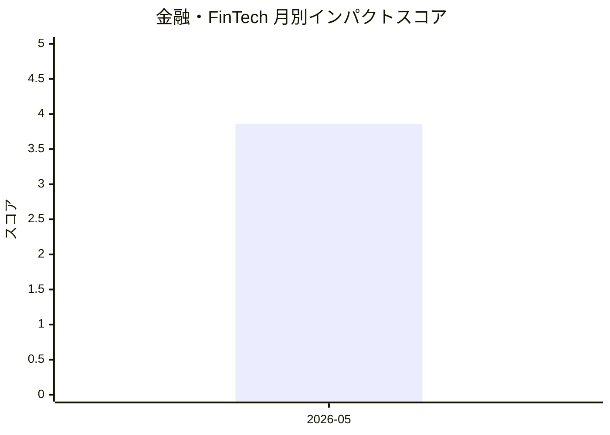

# 金融・FinTech — AI活用インパクトスコア

> 最終更新: 2026-07-11 22:41 UTC | 関連記事数: 3件

## AIインパクト概要

# 【金融・FinTech】へのAIインパクト分析

金融・FinTech分野では、生成AIが顧客接点とバックオフィス双方で変革をもたらしています。MUFGとGoogleの協業事例が示すように、商品選びから決済までの一連の顧客体験をAIで支援する動きが本格化しており、パーソナライズされた金融サービスの提供が現実化しています。また、対話型AIエージェント技術（Parloaなど）により、顧客が「話したくなる」自然な会話体験を実現し、コールセンターやチャットサポートの品質向上が期待されます。一方、M365 Copilotの導入事例が示すように、社内業務効率化においては過度なサポートを避け、実務に即した段階的な定着支援が成功の鍵となっています。

## 月別インパクトスコア推移

| 月 | 関連記事数 | 平均スコア |
|-----|-----------|-----------|
| 2026-05 | 3件 | 3.86 |

## 注目記事 TOP3

### 1. [Parloa builds service agents customers want to talk to](https://openai.com/index/parloa)
**4.7 ★★★★☆** | OpenAI Blog | 2026-05-07

ParloaがOpenAIのモデルを活用し、音声駆動型のAIカスタマーサービスエージェントを開発。企業が設計・シミュレーション・リアルタイム配置を実現する。

`音声AI` `カスタマーサービス` `AIエージェント` `OpenAI`

### 2. [M365 Copilotの定着に万全なサポートは逆効果？　社内利用率95％の企業が実践する5つの鉄則](https://www.itmedia.co.jp/enterprise/articles/2605/07/news113.html)
**3.5 ★★★☆☆** | ITmedia AI | 2026-05-07

Microsoft 365 Copilot導入企業の95％利用率達成事例から、組織への定着を促進する5つの鉄則を紹介。過度なサポートが却って利用阻害になる実態と運用改善のポイントを解説。

`M365 Copilot` `導入事例` `組織変革` `利用定着`

### 3. [商品選びから決済までをAIでお助け──MUFGがGoogleとタッグで実現目指す　Google Cloud上に](https://www.itmedia.co.jp/news/articles/2605/07/news110.html)
**3.4 ★★★☆☆** | ITmedia AI | 2026-05-07

MUFGとGoogleが連携し、Google Cloud上に商品選びから決済までをサポートするAIシステムを構築。金融機関が顧客体験向上を目指す取り組み。

`MUFG` `Google Cloud` `金融AI` `カスタマージャーニー`

---
*本ページは ai-research システムにより自動生成されました。*