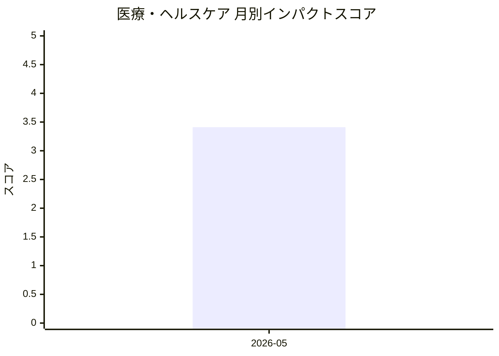

# 医療・ヘルスケア — AI活用インパクトスコア

> 最終更新: 2026-05-23 22:46 UTC | 関連記事数: 1件

## AIインパクト概要

# 医療・ヘルスケアへのAIインパクト分析

## トレンド概要

医療分野では、臨床医が監督するAIシステム「Clinician-in-the-Loop」(医師が診断や治療の最終判断を行い、AIはその支援役となる仕組み)が注目されています。特に言語療法など専門医療人材が不足している領域で、AIバーチャルセラピストが患者の練習セッションを支援しながら、重要な判断は人間の専門家に委ねる体制が実用化されつつあります。これにより医療アクセスの格差解消と、専門医の業務効率化の両立が期待されています。患者の安全性を確保しながらAIの利便性を活かす「人間中心のAI医療」モデルが、今後の医療AI導入の主流になると考えられます。

## 月別インパクトスコア推移

| 月 | 関連記事数 | 平均スコア |
|-----|-----------|-----------|
| 2026-05 | 1件 | 3.41 |

## 注目記事 TOP3

### 1. [Virtual Speech Therapist: A Clinician-in-the-Loop AI Sp](https://arxiv.org/abs/2605.01101)
**3.4 ★★★☆☆** | arXiv cs.AI | 2026-05-06

（APIキー未設定のためモックスコアを使用）

---
*本ページは ai-research システムにより自動生成されました。*