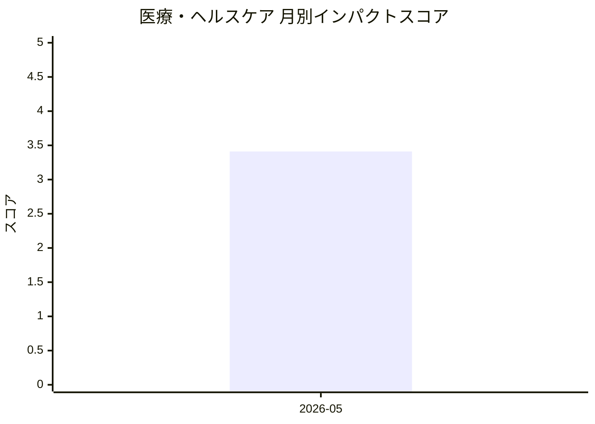

# 医療・ヘルスケア — AI活用インパクトスコア

> 最終更新: 2026-07-04 22:52 UTC | 関連記事数: 1件

## AIインパクト概要

# 医療・ヘルスケアへのAI技術インパクト分析

## 概要

音声言語療法(発音や言語能力を改善するリハビリテーション)の分野において、AI技術が臨床現場に革新をもたらしています。今回の研究では、臨床医が管理・監督する形でAIが仮想言語聴覚士として機能するシステムが提案されており、「Clinician-in-the-Loop(臨床医が介在するループ)」というアプローチが採用されています。

## 医療・ヘルスケアへの影響

医療・ヘルスケア分野において、このようなAI技術は**言語療法の提供体制を大きく変革する可能性**があります。特に言語聴覚士が不足している地域や、頻繁な通院が困難な患者にとって、**AIによる仮想セラピストが24時間アクセス可能なリハビリ支援を提供**できるメリットがあります。ただし、臨床医が監督する「Human-in-the-Loop」設計により、**医療の質と安全性を担保しながらAIの効率性を活用する**という、医療AI活用における理想的なバランスモデルを示しています。今後、このアプローチは他のリハビリテーション分野や慢性疾

## 月別インパクトスコア推移

| 月 | 関連記事数 | 平均スコア |
|-----|-----------|-----------|
| 2026-05 | 1件 | 3.41 |

## 注目記事 TOP3

### 1. [Virtual Speech Therapist: A Clinician-in-the-Loop AI Sp](https://arxiv.org/abs/2605.01101)
**3.4 ★★★☆☆** | arXiv cs.AI | 2026-05-06

（APIキー未設定のためモックスコアを使用）

---
*本ページは ai-research システムにより自動生成されました。*