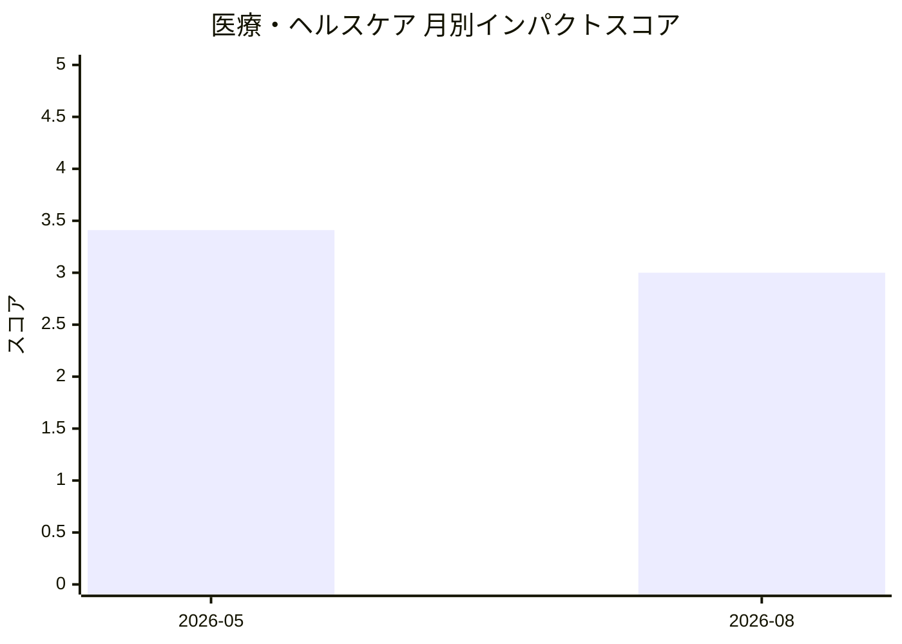

# 医療・ヘルスケア — AI活用インパクトスコア

> 最終更新: 2026-08-22 22:14 UTC | 関連記事数: 2件

## 月別インパクトスコア推移

| 月 | 関連記事数 | 平均スコア |
|-----|-----------|-----------|
| 2026-08 | 1件 | 3.00 |
| 2026-05 | 1件 | 3.41 |

## 注目記事 TOP3

### 1. [Virtual Speech Therapist: A Clinician-in-the-Loop AI Sp](https://arxiv.org/abs/2605.01101)
**3.4 ★★★☆☆** | arXiv cs.AI | 2026-05-06

（APIキー未設定のためモックスコアを使用）

### 2. [毎週AIエージェントにBTOパソコン約1,000機種を調査させて、コスパの良い機種に絞って自サイトに掲載してい](https://zenn.dev/specsense/articles/00122f738901db)
**3.0 ★★★☆☆** | Zenn AI トピック | 2026-08-21

（スコアリングAPIエラー）

---
*本ページは ai-research システムにより自動生成されました。*