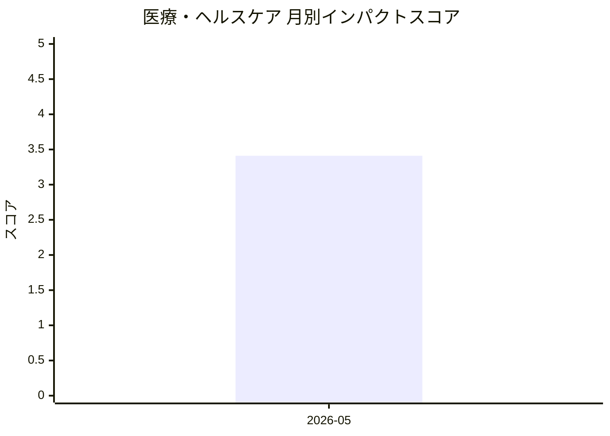

# 医療・ヘルスケア — AI活用インパクトスコア

> 最終更新: 2026-05-16 22:39 UTC | 関連記事数: 1件

## AIインパクト概要

# 医療・ヘルスケアへのAIインパクト分析

## 概要

医療・ヘルスケア分野では、AI技術が専門家の監督のもとで患者ケアを支援する「臨床医参加型AI」の開発が進んでいます。特に注目されているのが、音声言語療法士の業務を支援するバーチャルセラピストシステムです。このシステムは、セラピストが設定した治療計画に基づいて患者と対話し、発話練習を実施・評価することで、専門家不足の解消と治療アクセスの向上を実現します。AI単独での診療ではなく、臨床医が治療方針を決定し、AIが日常的なセッションを担当する「人間とAIの協働モデル」により、医療の質を保ちながら効率化を図る新たなアプローチとして期待されています。

## 月別インパクトスコア推移

| 月 | 関連記事数 | 平均スコア |
|-----|-----------|-----------|
| 2026-05 | 1件 | 3.41 |

## 注目記事 TOP3

### 1. [Virtual Speech Therapist: A Clinician-in-the-Loop AI Sp](https://arxiv.org/abs/2605.01101)
**3.4 ★★★☆☆** | arXiv cs.AI | 2026-05-06

（APIキー未設定のためモックスコアを使用）

---
*本ページは ai-research システムにより自動生成されました。*