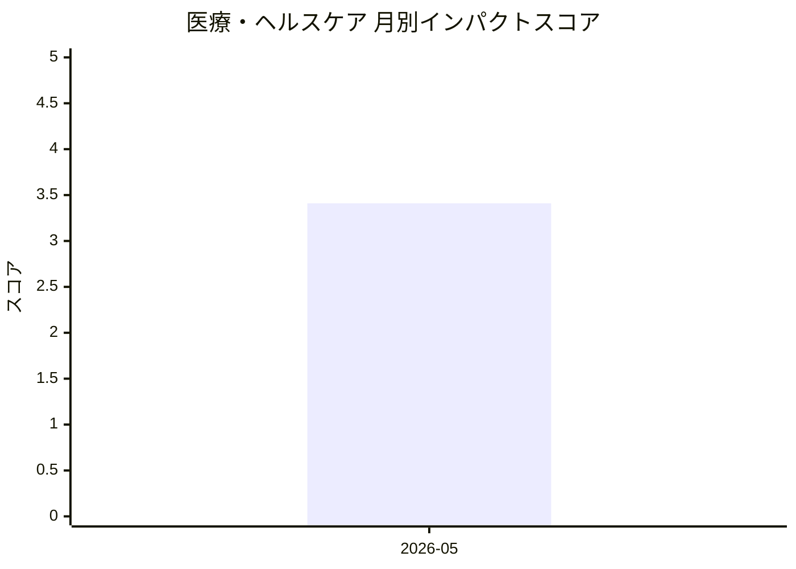

# 医療・ヘルスケア — AI活用インパクトスコア

> 最終更新: 2026-06-06 22:58 UTC | 関連記事数: 1件

## AIインパクト概要

# 医療・ヘルスケアへのAIインパクト分析

## 概要

医療・ヘルスケア分野において、**AIによる仮想言語療法士**のような臨床支援システムが登場しています。これは、専門医療者の監督下でAIが患者の言語療法を支援する「Clinician-in-the-Loop(臨床家を介在させるAI)」というアプローチです。このような技術は、言語聴覚士などの専門家が不足している地域でも質の高い療法へのアクセスを可能にし、医療格差の解消に貢献する可能性があります。また、AIが日常的なセッションを担当することで、人間の専門家はより複雑なケースや治療計画の立案に集中できるようになり、医療の効率性と質の両面での向上が期待されます。

## 月別インパクトスコア推移

| 月 | 関連記事数 | 平均スコア |
|-----|-----------|-----------|
| 2026-05 | 1件 | 3.41 |

## 注目記事 TOP3

### 1. [Virtual Speech Therapist: A Clinician-in-the-Loop AI Sp](https://arxiv.org/abs/2605.01101)
**3.4 ★★★☆☆** | arXiv cs.AI | 2026-05-06

（APIキー未設定のためモックスコアを使用）

---
*本ページは ai-research システムにより自動生成されました。*