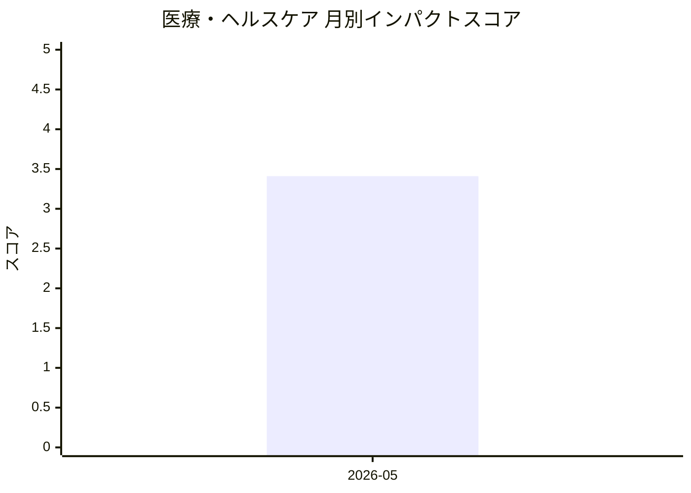

# 医療・ヘルスケア — AI活用インパクトスコア

> 最終更新: 2026-08-01 22:47 UTC | 関連記事数: 1件

## AIインパクト概要

# 医療・ヘルスケアへのAIインパクト分析

## 現状のトレンド

医療・ヘルスケア分野では、臨床専門家が監督する「クリニシャン・イン・ザ・ループ」方式のAI活用が注目されています。特に言語聴覚療法などのリハビリテーション領域で、AIが仮想セラピストとして患者をサポートしながら、最終的な判断は人間の専門家が行うハイブリッドモデルが実用化されつつあります。

## ビジネスへの影響

このようなAI技術により、医療の質を保ちながら専門家不足の解消や遠隔医療の拡充が期待できます。患者は時間や場所の制約を受けずにリハビリを受けられ、医療従事者はより複雑なケースに集中できるため、医療サービスの効率化とアクセス向上の両立が可能になります。日本のような高齢化社会では、限られた医療リソースを最大化する手段として、AI支援医療サービスの市場拡大が見込まれます。

## 月別インパクトスコア推移

| 月 | 関連記事数 | 平均スコア |
|-----|-----------|-----------|
| 2026-05 | 1件 | 3.41 |

## 注目記事 TOP3

### 1. [Virtual Speech Therapist: A Clinician-in-the-Loop AI Sp](https://arxiv.org/abs/2605.01101)
**3.4 ★★★☆☆** | arXiv cs.AI | 2026-05-06

（APIキー未設定のためモックスコアを使用）

---
*本ページは ai-research システムにより自動生成されました。*