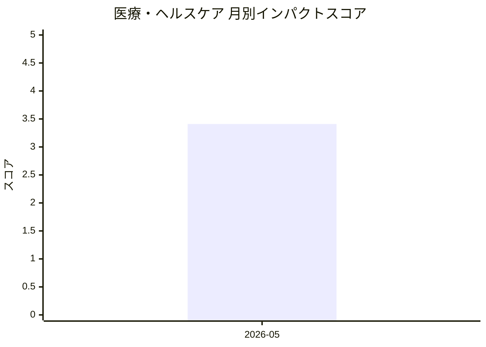

# 医療・ヘルスケア — AI活用インパクトスコア

> 最終更新: 2026-05-30 22:53 UTC | 関連記事数: 1件

## AIインパクト概要

# 医療・ヘルスケアにおけるAI技術のインパクト

医療・ヘルスケア分野では、AIがセラピスト(治療の専門家)の役割を補完する技術開発が進んでいます。今回の注目記事では、言語聴覚士の指導のもとでAIが音声療法(発話障害などのリハビリテーション)を支援する「Clinician-in-the-Loop(医療専門家を介在させたAIシステム)」が紹介されています。このアプローチは、完全自動化ではなく専門家の知見を活かしながらAIが補助することで、質の高い医療サービスの提供範囲を拡大し、医療アクセスが限られた地域や患者にも専門的なケアを届けられる可能性を示しています。専門家とAIの協働モデルは、医療の質と安全性を保ちながら効率化を実現する重要なトレンドと言えます。

## 月別インパクトスコア推移

| 月 | 関連記事数 | 平均スコア |
|-----|-----------|-----------|
| 2026-05 | 1件 | 3.41 |

## 注目記事 TOP3

### 1. [Virtual Speech Therapist: A Clinician-in-the-Loop AI Sp](https://arxiv.org/abs/2605.01101)
**3.4 ★★★☆☆** | arXiv cs.AI | 2026-05-06

（APIキー未設定のためモックスコアを使用）

---
*本ページは ai-research システムにより自動生成されました。*