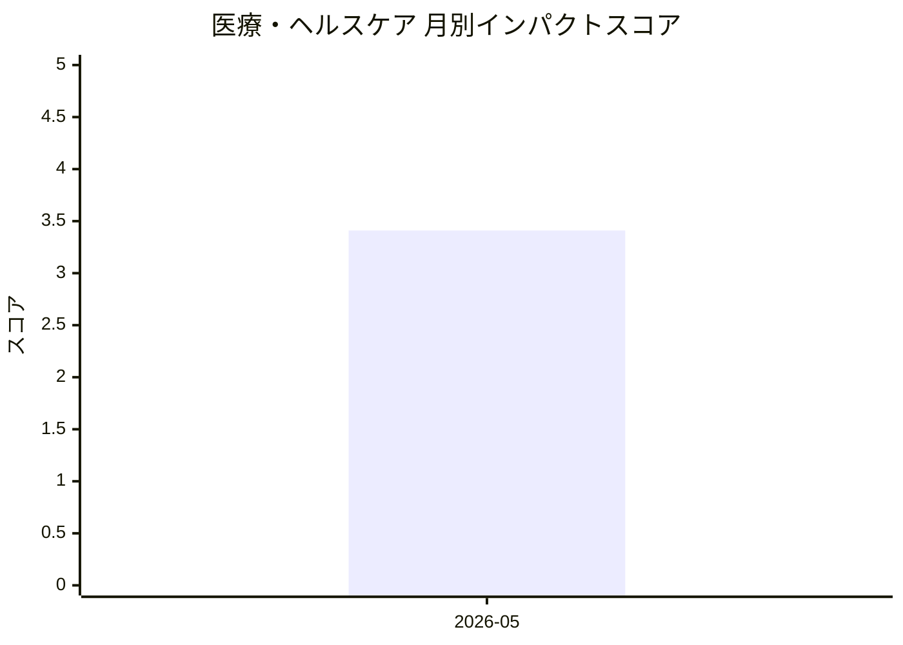

# 医療・ヘルスケア — AI活用インパクトスコア

> 最終更新: 2026-06-13 22:58 UTC | 関連記事数: 1件

## AIインパクト概要

# 医療・ヘルスケアへのAIインパクト分析

## 概要

医療・ヘルスケア分野では、**臨床医が監督する形でのAI活用**が進展しています。特に注目すべきは、専門家の知見を組み込みながら患者ケアを支援する「Clinician-in-the-Loop(臨床医参加型)」のアプローチです。

## 主な影響

言語聴覚療法などの専門的なリハビリテーション分野において、AIが仮想セラピストとして機能することで、**医療専門家の不足を補完**し、患者へのアクセシビリティを向上させる可能性があります。ただし、医療の質と安全性を担保するため、AIは完全自律ではなく、専門家の監督下で運用される設計が重視されています。この技術は、遠隔医療や在宅ケアの充実にも寄与し、医療資源の地域格差解消にも貢献できるでしょう。

## 月別インパクトスコア推移

| 月 | 関連記事数 | 平均スコア |
|-----|-----------|-----------|
| 2026-05 | 1件 | 3.41 |

## 注目記事 TOP3

### 1. [Virtual Speech Therapist: A Clinician-in-the-Loop AI Sp](https://arxiv.org/abs/2605.01101)
**3.4 ★★★☆☆** | arXiv cs.AI | 2026-05-06

（APIキー未設定のためモックスコアを使用）

---
*本ページは ai-research システムにより自動生成されました。*