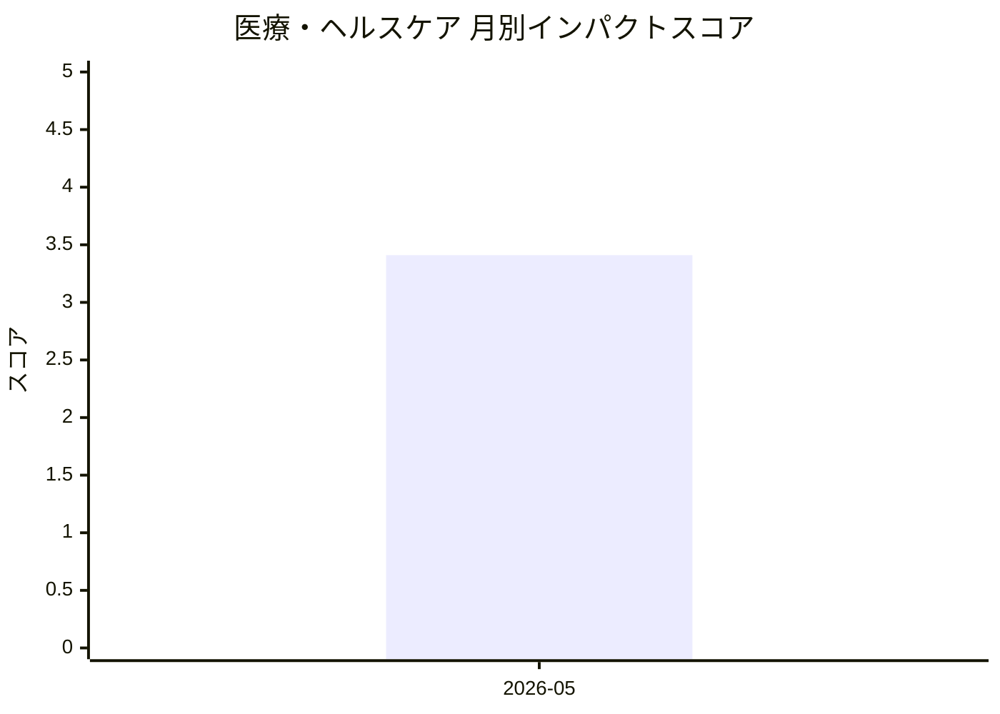

# 医療・ヘルスケア — AI活用インパクトスコア

> 最終更新: 2026-07-25 22:46 UTC | 関連記事数: 1件

## AIインパクト概要

# 医療・ヘルスケアへのAIインパクト分析

## 概要

医療・ヘルスケア分野では、**AIを活用した仮想言語療法士**が開発されています。この技術は、専門家の監督下でAIが患者のリハビリテーションを支援する「Clinician-in-the-Loop(臨床家を介在させた)」アプローチを採用しています。

## 主な影響

言語聴覚療法におけるAI導入により、**医療リソースの不足を補完**しながら、専門家の知見を組み込んだ質の高いリハビリサービスの提供が可能になります。特に、地方や医療過疎地域など専門家へのアクセスが限られた環境でも、継続的なケアを実現できる点が注目されています。ただし、あくまで臨床家の監督下で機能するため、完全な自動化ではなく、**人間の専門性とAIの効率性を組み合わせた協働モデル**として発展していく見込みです。

## 月別インパクトスコア推移

| 月 | 関連記事数 | 平均スコア |
|-----|-----------|-----------|
| 2026-05 | 1件 | 3.41 |

## 注目記事 TOP3

### 1. [Virtual Speech Therapist: A Clinician-in-the-Loop AI Sp](https://arxiv.org/abs/2605.01101)
**3.4 ★★★☆☆** | arXiv cs.AI | 2026-05-06

（APIキー未設定のためモックスコアを使用）

---
*本ページは ai-research システムにより自動生成されました。*