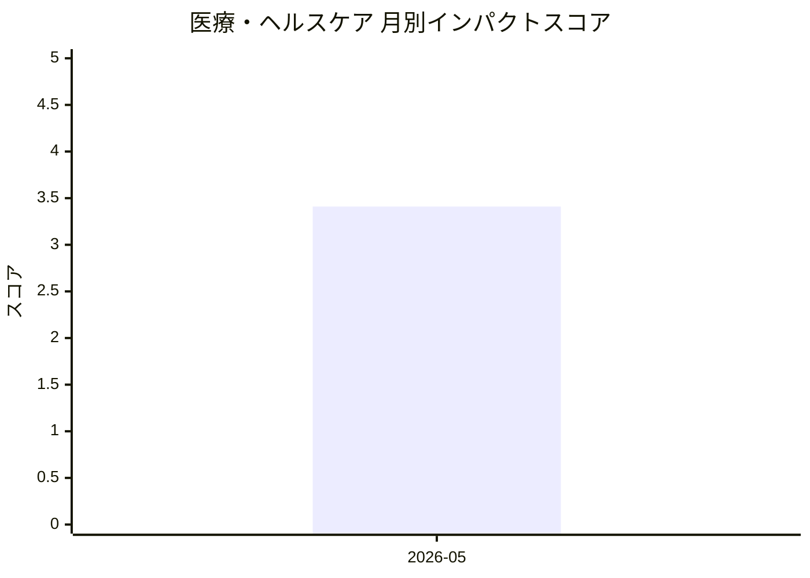

# 医療・ヘルスケア — AI活用インパクトスコア

> 最終更新: 2026-08-08 22:21 UTC | 関連記事数: 1件

## AIインパクト概要

# 医療・ヘルスケア分野へのAI技術のインパクト

音声言語療法の領域では、臨床医が監督するループ型AI（医療専門家が介入・確認できる仕組みを持つAI）により、言語障害を持つ患者により多くの練習機会を提供できるようになっています。従来は医療従事者の時間的制約から限られていたリハビリテーションの頻度を、AIアシスタントが補完することで大幅に増やすことが可能となります。ただし「Clinician-in-the-Loop」(臨床医が意思決定プロセスに関与し続ける方式)のアプローチが重視されており、完全な自動化ではなく、専門家の監督下で患者の安全性と治療の質を担保しながらAIを活用する方向性が示されています。これにより医療の質を維持しながら、医療アクセスの向上とコスト削減の両立が期待されます。

## 月別インパクトスコア推移

| 月 | 関連記事数 | 平均スコア |
|-----|-----------|-----------|
| 2026-05 | 1件 | 3.41 |

## 注目記事 TOP3

### 1. [Virtual Speech Therapist: A Clinician-in-the-Loop AI Sp](https://arxiv.org/abs/2605.01101)
**3.4 ★★★☆☆** | arXiv cs.AI | 2026-05-06

（APIキー未設定のためモックスコアを使用）

---
*本ページは ai-research システムにより自動生成されました。*