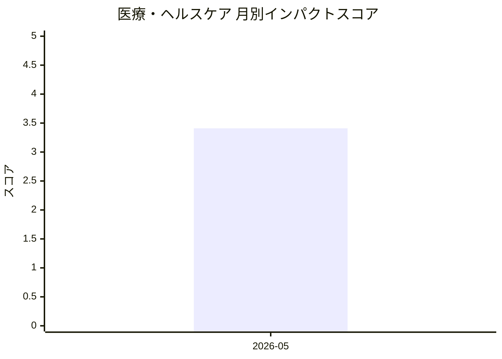

# 医療・ヘルスケア — AI活用インパクトスコア

> 最終更新: 2026-05-09 22:37 UTC | 関連記事数: 1件

## AIインパクト概要

# 【医療・ヘルスケア】へのAIインパクト分析

## 概要

医療・ヘルスケア分野において、臨床専門家とAIが協働する「クリニシャン・イン・ザ・ループ」モデルが注目されています。特に言語療法(speech therapy)分野では、専門家不足という課題に対し、AIが補助的役割を果たしながらも、医療従事者の監督下で質の高いケアを提供する仕組みが開発されています。

## ビジネスへの影響

この技術は**医療アクセスの格差解消**と**専門家の生産性向上**という2つの大きなインパクトをもたらします。言語聴覚士などの専門家が不足する地域でもAIによる仮想セラピストが初期評価や日常的なセッションを担当し、専門家は複雑なケースや重要な判断に集中できるようになります。医療機関にとっては、限られた人材リソースで**より多くの患者に継続的なケアを提供**できるビジネスモデルが実現可能となり、遠隔医療やデジタルヘルス市場の拡大が期待されます。

## 月別インパクトスコア推移

| 月 | 関連記事数 | 平均スコア |
|-----|-----------|-----------|
| 2026-05 | 1件 | 3.41 |

## 注目記事 TOP3

### 1. [Virtual Speech Therapist: A Clinician-in-the-Loop AI Sp](https://arxiv.org/abs/2605.01101)
**3.4 ★★★☆☆** | arXiv cs.AI | 2026-05-06

（APIキー未設定のためモックスコアを使用）

---
*本ページは ai-research システムにより自動生成されました。*