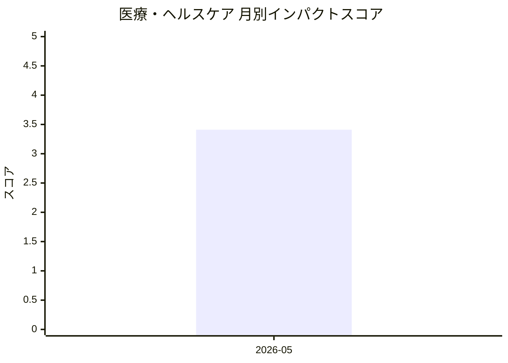

# 医療・ヘルスケア — AI活用インパクトスコア

> 最終更新: 2026-07-11 22:41 UTC | 関連記事数: 1件

## AIインパクト概要

# 医療・ヘルスケア分野へのAI技術のインパクト

## トレンド概要

音声言語療法の分野で、臨床医が治療プロセスに関与し続けられる「Clinician-in-the-Loop(臨床医参加型)」のAI仮想セラピストシステムが開発されています。この技術は、AIによる自動化と専門家の監督を組み合わせることで、言語障害のリハビリテーションをより効率的かつ質の高いものにすることを目指しています。

従来は対面での言語療法が中心でしたが、AIセラピストの導入により、患者は自宅で継続的なトレーニングを受けられるようになり、医療アクセスの改善と治療頻度の向上が期待できます。同時に、臨床医がAIの判断を監督・修正できる仕組みにより、医療の安全性と専門性が担保されるため、完全自動化への懸念を軽減しながら医療の質を維持できる点が特徴です。

このアプローチは、リハビリテーション医療における人材不足の解消や、遠隔地・高齢化地域での医療サービス提供において重要な役割を果たすと考えられます。

## 月別インパクトスコア推移

| 月 | 関連記事数 | 平均スコア |
|-----|-----------|-----------|
| 2026-05 | 1件 | 3.41 |

## 注目記事 TOP3

### 1. [Virtual Speech Therapist: A Clinician-in-the-Loop AI Sp](https://arxiv.org/abs/2605.01101)
**3.4 ★★★☆☆** | arXiv cs.AI | 2026-05-06

（APIキー未設定のためモックスコアを使用）

---
*本ページは ai-research システムにより自動生成されました。*