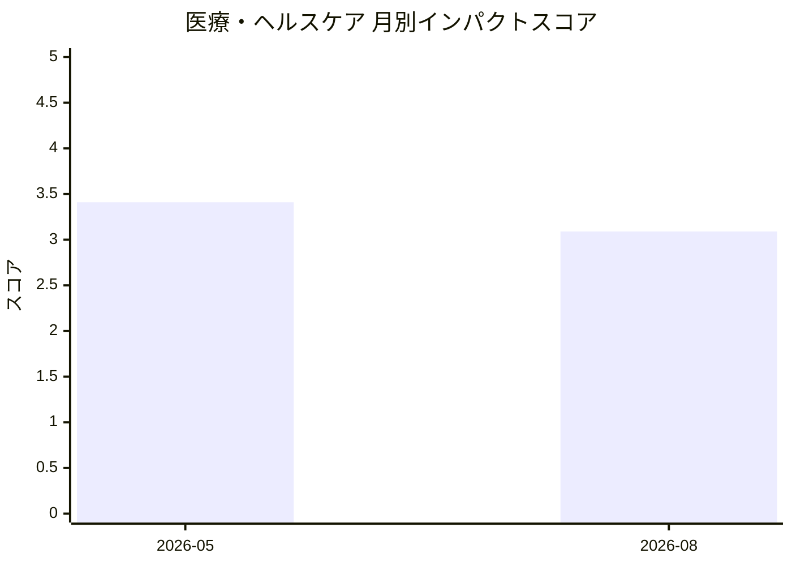

# 医療・ヘルスケア — AI活用インパクトスコア

> 最終更新: 2026-09-05 23:29 UTC | 関連記事数: 6件

## 月別インパクトスコア推移

| 月 | 関連記事数 | 平均スコア |
|-----|-----------|-----------|
| 2026-08 | 5件 | 3.09 |
| 2026-05 | 1件 | 3.41 |

## 注目記事 TOP3

### 1. [Virtual Speech Therapist: A Clinician-in-the-Loop AI Sp](https://arxiv.org/abs/2605.01101)
**3.4 ★★★☆☆** | arXiv cs.AI | 2026-05-06

（APIキー未設定のためモックスコアを使用）

### 2. [Standalone LLM and a Pre-specified Agentic Pipeline for](https://arxiv.org/abs/2608.26109)
**3.3 ★★★☆☆** | arXiv cs.AI | 2026-08-28

（スコアリングAPIエラー）

### 3. [Methodological and Conceptual Framework for 5D Multi-Ta](https://arxiv.org/abs/2608.26149)
**3.3 ★★★☆☆** | arXiv cs.AI | 2026-08-29

（スコアリングAPIエラー）

---
*本ページは ai-research システムにより自動生成されました。*