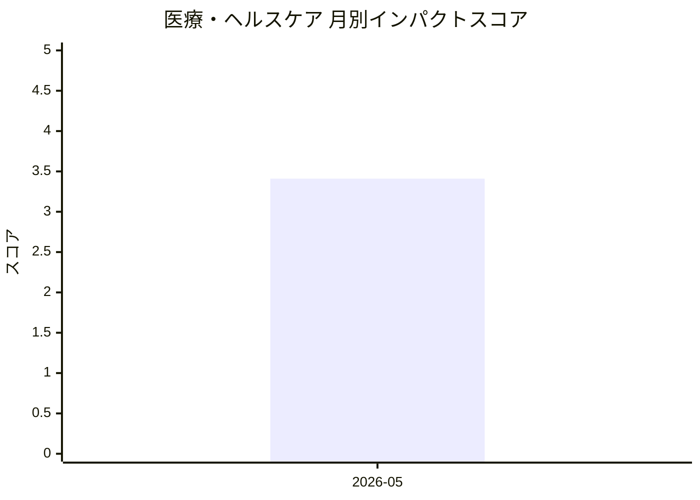

# 医療・ヘルスケア — AI活用インパクトスコア

> 最終更新: 2026-06-20 23:01 UTC | 関連記事数: 1件

## AIインパクト概要

# 医療・ヘルスケア分野へのAI技術のインパクト

医療・ヘルスケア分野では、**AI音声療法士**のような「臨床医参加型AI(Clinician-in-the-Loop)」技術が注目されています。これは、専門医が監督しながらAIが患者とのセッションを行う仕組みで、言語聴覚士の不足という社会課題に対応できます。特に地方や医療過疎地域において、専門家による高品質な治療へのアクセスを拡大し、治療コストの削減と効率化が期待されています。今後、音声療法以外の理学療法やメンタルヘルスケアなど、他の医療分野への応用も見込まれており、医療の民主化(より多くの人が質の高い医療にアクセスできること)を推進する重要な技術となるでしょう。

## 月別インパクトスコア推移

| 月 | 関連記事数 | 平均スコア |
|-----|-----------|-----------|
| 2026-05 | 1件 | 3.41 |

## 注目記事 TOP3

### 1. [Virtual Speech Therapist: A Clinician-in-the-Loop AI Sp](https://arxiv.org/abs/2605.01101)
**3.4 ★★★☆☆** | arXiv cs.AI | 2026-05-06

（APIキー未設定のためモックスコアを使用）

---
*本ページは ai-research システムにより自動生成されました。*