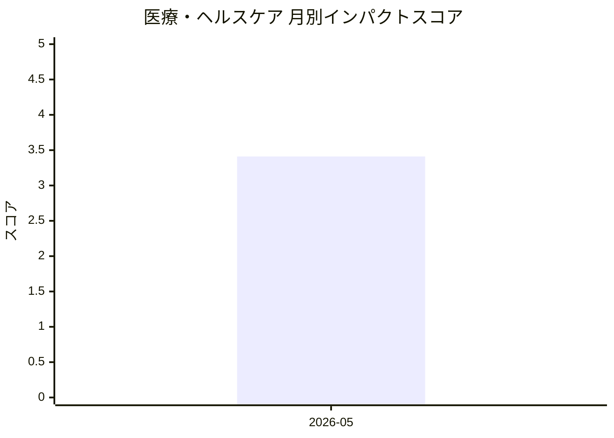

# 医療・ヘルスケア — AI活用インパクトスコア

> 最終更新: 2026-06-27 22:58 UTC | 関連記事数: 1件

## AIインパクト概要

# 医療・ヘルスケアへのAIインパクト分析

## 概要

医療・ヘルスケア分野では、**AI言語療法士システム**が注目を集めています。これは、臨床医が監督する形でAIが音声言語療法を支援する「クリニシャン・イン・ザ・ループ(Clinician-in-the-Loop)」アプローチを採用したシステムです。

## 主なインパクト

従来は専門家による対面セッションが必要だった言語療法において、AIが24時間365日のアクセス可能な練習環境を提供することで、**療法へのアクセシビリティが劇的に向上**します。専門家不足や地理的制約により十分な治療を受けられなかった患者層への医療提供が可能になり、医療格差の解消に貢献します。ただし、最終的な判断や治療計画は臨床医が担うことで、AI活用と医療の質保証を両立させる新しいハイブリッド型医療モデルが確立されつつあります。この動きは、リハビリテーション医療全般においてAI支援システムが標準化される先駆けとなる可能性があります。

## 月別インパクトスコア推移

| 月 | 関連記事数 | 平均スコア |
|-----|-----------|-----------|
| 2026-05 | 1件 | 3.41 |

## 注目記事 TOP3

### 1. [Virtual Speech Therapist: A Clinician-in-the-Loop AI Sp](https://arxiv.org/abs/2605.01101)
**3.4 ★★★☆☆** | arXiv cs.AI | 2026-05-06

（APIキー未設定のためモックスコアを使用）

---
*本ページは ai-research システムにより自動生成されました。*