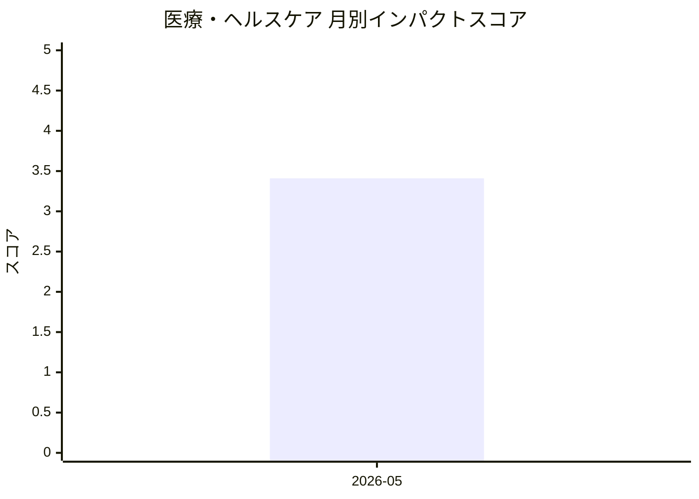

# 医療・ヘルスケア — AI活用インパクトスコア

> 最終更新: 2026-07-18 22:42 UTC | 関連記事数: 1件

## AIインパクト概要

# 医療・ヘルスケア分野へのAI技術のインパクト

医療・ヘルスケア分野では、AI言語療法士のような「臨床家を支援するAIシステム」の開発が進んでいます。これは医療専門家が完全に関与し続けながら(Clinician-in-the-Loop: 臨床家を判断の輪の中に常に含む仕組み)、AIが言語療法などの診断・治療サポートを提供する技術です。このアプローチにより、医療従事者の業務負担を軽減しつつ、専門家の判断力と経験を活かした質の高い医療サービスの提供が可能になります。特に専門医療従事者が不足している地域や分野において、AIが補助的役割を果たすことで、医療アクセスの改善が期待されています。

## 月別インパクトスコア推移

| 月 | 関連記事数 | 平均スコア |
|-----|-----------|-----------|
| 2026-05 | 1件 | 3.41 |

## 注目記事 TOP3

### 1. [Virtual Speech Therapist: A Clinician-in-the-Loop AI Sp](https://arxiv.org/abs/2605.01101)
**3.4 ★★★☆☆** | arXiv cs.AI | 2026-05-06

（APIキー未設定のためモックスコアを使用）

---
*本ページは ai-research システムにより自動生成されました。*