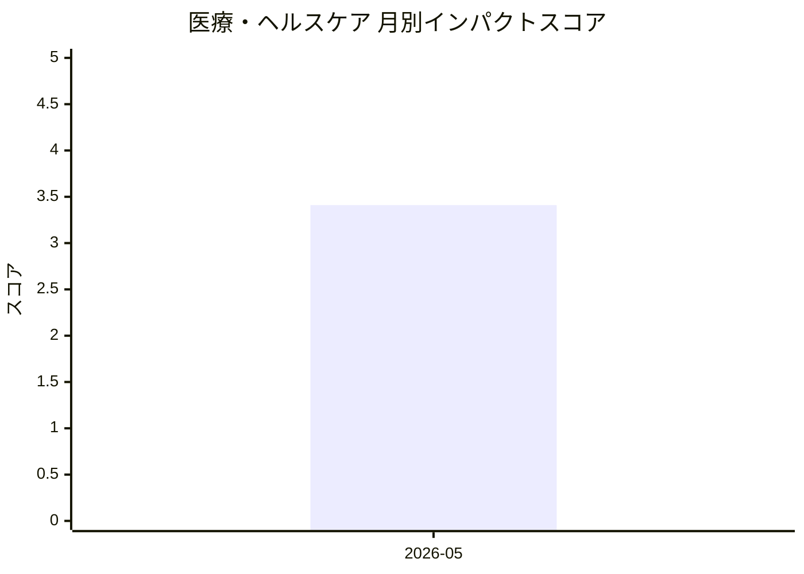

# 医療・ヘルスケア — AI活用インパクトスコア

> 最終更新: 2026-08-15 22:14 UTC | 関連記事数: 1件

## AIインパクト概要

# 医療・ヘルスケアへのAIインパクト分析

## 概要

注目記事は、臨床医が介在するループ構造を持つAI音声療法士に関する研究で、医療現場における生成AI活用の新しいアプローチを示しています。このシステムは、AIが自律的に治療を行うのではなく、専門家の監督下で補助的役割を果たす「クリニシャン・イン・ザ・ループ」モデルを採用しており、医療の質と安全性を担保しながら効率化を実現する可能性があります。言語療法や音声療法といった専門的リハビリテーション分野において、AIが専門家不足の解消やアクセス向上に貢献できることを示唆する一方、最終的な判断と責任は人間の臨床医が保持するという倫理的・実務的バランスを重視した設計となっています。この手法は、他の医療分野への応用可能性も高く、AI支援医療の実用化に向けた重要なモデルケースとなりえます。

## 月別インパクトスコア推移

| 月 | 関連記事数 | 平均スコア |
|-----|-----------|-----------|
| 2026-05 | 1件 | 3.41 |

## 注目記事 TOP3

### 1. [Virtual Speech Therapist: A Clinician-in-the-Loop AI Sp](https://arxiv.org/abs/2605.01101)
**3.4 ★★★☆☆** | arXiv cs.AI | 2026-05-06

（APIキー未設定のためモックスコアを使用）

---
*本ページは ai-research システムにより自動生成されました。*