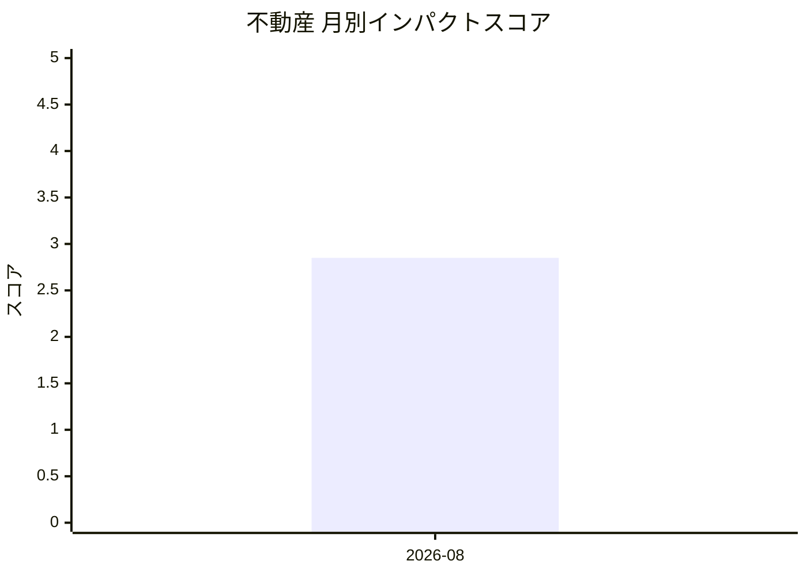

# 不動産 — AI活用インパクトスコア

> 最終更新: 2026-09-05 23:29 UTC | 関連記事数: 1件

## 月別インパクトスコア推移

| 月 | 関連記事数 | 平均スコア |
|-----|-----------|-----------|
| 2026-08 | 1件 | 2.85 |

## 注目記事 TOP3

### 1. [Sony Music, Warner sue Anthropic, alleging a “brazen ca](https://techcrunch.com/2026/08/29/sony-music-warner-sue-anthropic-alleging-a-brazen-campaign-of-intellectual-property-theft/)
**2.9 ★★☆☆☆** | TechCrunch AI | 2026-08-29

（スコアリングAPIエラー）

---
*本ページは ai-research システムにより自動生成されました。*